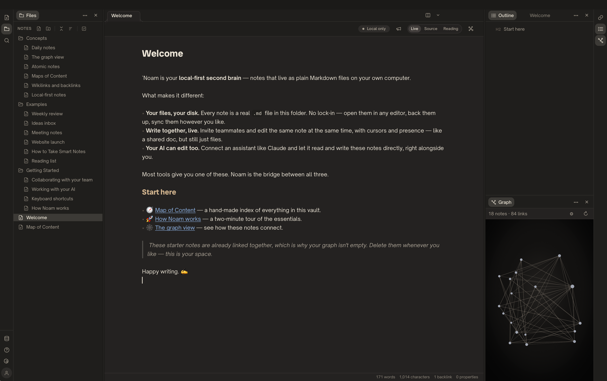
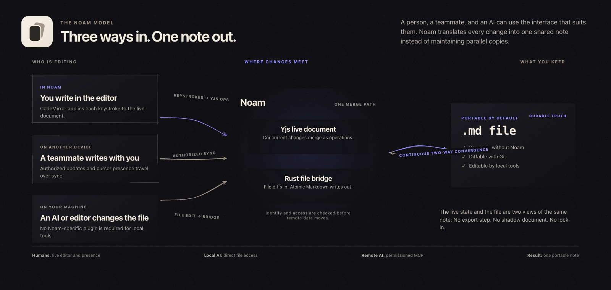
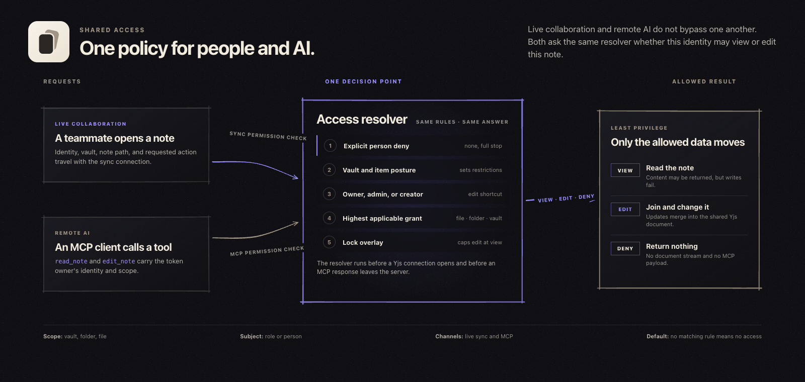
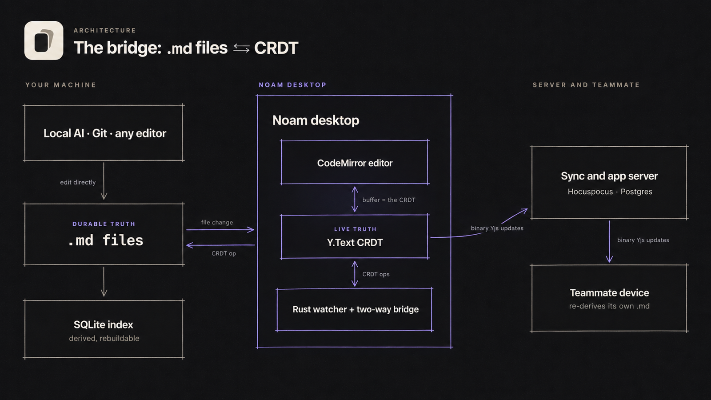
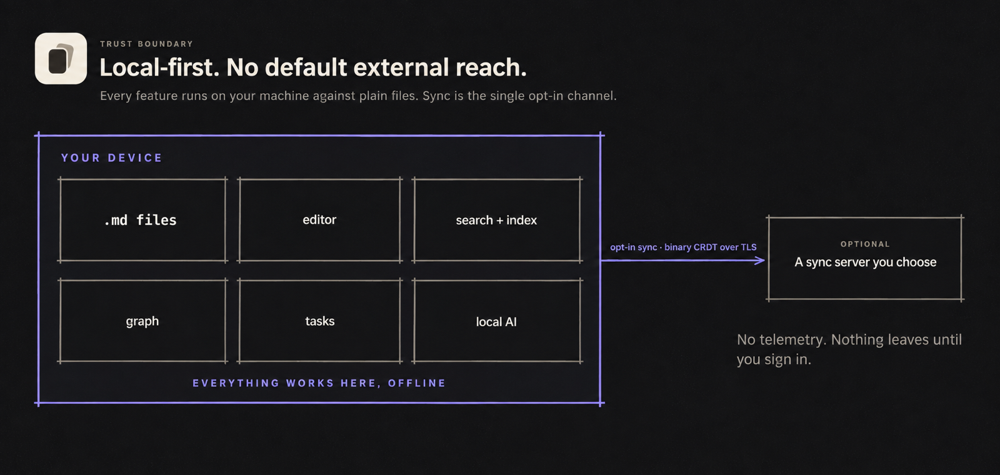

<div align="center">


# noam

### Local-first Markdown for people and AI, edited together in real time.

Noam keeps every note as a real `.md` file on your computer, then adds live collaboration, scoped permissions, and AI access without replacing the files with a proprietary document format.


[Product overview](docs/Noam.md) · [Architecture specs](docs/specs/00-architecture-overview.md) · [Build status](docs/STATUS.md) · [Contributing](CONTRIBUTING.md)

</div>

## Noam in practice



The desktop app keeps the file tree, Markdown editor, links, outline, and graph in one workspace.

## The problem Noam solves

Local Markdown is durable and easy to inspect. It works with Git, text editors, scripts, and local AI agents. Real-time editors solve a different problem: several people can type in the same document without overwriting one another.

Noam keeps both models:

- **Markdown is the durable truth.** Notes remain normal files in a folder you control.
- **Yjs is the live truth.** While a note is open or syncing, edits merge as CRDT operations.
- **A Rust bridge keeps them equal.** File changes become Yjs operations; Yjs changes are written back atomically.
- **Permissions apply before data moves.** Human sync and MCP access use the same folder and file rules.

The result is a workspace that a person, teammate, or AI can edit through the interface best suited to them, without creating separate copies of the note.



People edit through Noam, local tools edit the file, and remote clients send authorized operations. The Yjs document and the Markdown file stay two views of the same note.

## Why Noam is different from Obsidian

Obsidian is a strong personal knowledge tool with local Markdown and a mature plugin and theme ecosystem. Noam starts from the same open-file premise. It is built for a shared workspace where people and AI edit the same notes live.

| Question | Noam | Obsidian |
| :--- | :--- | :--- |
| Where are notes stored? | Plain Markdown files in a local folder. | [Plain Markdown files in a local vault](https://obsidian.md/help/Files%2Band%2Bfolders/How%2BObsidian%2Bstores%2Bdata). |
| Can two people edit the same note live? | Yes. Yjs merges concurrent edits and awareness carries live cursors. | [Not through Obsidian Sync](https://obsidian.md/help/Obsidian%2BSync/Collaborate%2Bon%2Ba%2Bshared%2Bvault); changes appear after sync rather than as collaborative live editing. |
| Can access differ by folder, file, or person? | Yes. A grant can allow view or edit access, and an explicit deny can remove access. | [Shared-vault collaborators have the same permissions](https://obsidian.md/help/Obsidian%2BSync/Collaborate%2Bon%2Ba%2Bshared%2Bvault); fine-grained permissions are not supported. |
| How does AI reach the notes? | Local agents edit the files directly. Remote agents use built-in MCP tokens constrained by the same ACL as people. | Through local files, external tools, or community plugins. |
| Who runs sync? | You can run the included Node, Hocuspocus, and Postgres stack on your own infrastructure. | Obsidian Sync is a managed service; [each collaborator needs a Sync subscription](https://obsidian.md/help/Obsidian%2BSync/Collaborate%2Bon%2Ba%2Bshared%2Bvault). |
| What is the product emphasis? | Team editing, governed AI access, and an explicit file-to-CRDT bridge. | Personal knowledge management and a broad [community plugin](https://obsidian.md/help/Extending%2BObsidian/Community%2Bplugins) and [theme](https://obsidian.md/help/Extending%2BObsidian/Themes) ecosystem. |

Noam does not reproduce Obsidian's plugin catalog. It focuses on something Obsidian Sync does not provide: live editing of the same note, backed by local Markdown, with permissions that also govern AI access.



The same access resolver protects live sync and remote MCP calls. Vault posture, roles, direct and inherited grants, locks, and explicit person denies resolve to view, edit, or no access before note data moves.

## Architecture



The bridge does the hard part:

1. A person, Git operation, text editor, or local AI changes a `.md` file.
2. The Rust watcher computes the change and applies it to a Yjs `Y.Text` document.
3. CodeMirror and authorized peers edit the same Yjs document.
4. Remote operations are serialized back to the local file with echo-loop suppression and atomic writes.
5. SQLite indexes search, links, and tags from the files. It is derived data and can be rebuilt.

On the server, Hocuspocus authenticates each document connection. Postgres stores binary Yjs updates and collaboration metadata. The desktop app recreates the readable Markdown file on each authorized device.

## What works today

- Open an existing Markdown folder or create a new vault.
- Edit raw Markdown with autosave, file watching, search, backlinks, and tags.
- Reconcile external file edits with the Yjs document without echo loops.
- Sign in, create a team vault, invite members, and share a vault, folder, or note.
- Assign view, edit, private, and per-person deny rules.
- Sync note content, structure, presence, item colors, and attachments.
- Create MCP tokens for remote agents; local agents can work directly on disk.
- Run the sync stack yourself with Docker and Postgres.

Noam is in active development. Signed, Apple-notarized macOS builds are published on the [Releases](../../releases) page (Apple Silicon; auto-update is not enabled yet). The live checklist in [`docs/STATUS.md`](docs/STATUS.md) separates implemented behavior from planned work.

## Capabilities

Beyond the core editor and sync, Noam adds a layer of automation and structured views. All of it is built on the same plain Markdown files, so nothing here locks a note into Noam.

**Command workflows.** A workflow is an ordinary Markdown note that describes a prompt, a template, and a target. Run it from the action palette (`⌘⇧P`), the editor's `/` slash menu, or a keyboard shortcut you assign. Workflows fill in variables such as the date, the current selection, or the clipboard, then create a note from a template or append to an existing one. Because a workflow is a note, it syncs, versions, and travels like any other file.

**Tasks.** Checkbox tasks use the familiar Obsidian Tasks markers: due `📅`, scheduled `⏳`, start `🛫`, done `✅`, a priority, and recurrence `🔁`. A Tasks panel lists them with a small query language and saved filters, and a task can be completed, rescheduled, or reprioritized from the keyboard. Completing a recurring task spawns its next occurrence with a stable identity, so two devices completing it at once converge instead of duplicating. A Rust index keeps the list fast in large vaults.

**Calendar.** A month view marks the days that have notes and counts the tasks due on each. Opening a day creates or opens its daily note from your template; the weekly note works the same way. Its date tokens, including ISO week numbers, are shared with the workflow engine, so one date vocabulary drives both.

**Kanban boards.** A note marked as a board renders as columns of cards that move between lanes by keyboard, with a one-click switch back to the raw Markdown. The format is compatible with Obsidian Kanban, and a move re-resolves its target against the live text, so a concurrent edit elsewhere never misplaces a card.

**Packages and import.** Workflows and templates bundle into a portable package to share or reinstall; applying one is atomic and rolls back on failure. A QuickAdd importer converts many Obsidian QuickAdd macros into Noam workflows and reports anything it cannot translate rather than guessing.

## Privacy and no default external reach

Noam is local-first in the strict sense. Notes are plain files on your disk, and the app does its work — editing, search, indexing, the graph, tasks, and local AI access — entirely on your machine.



- **Nothing leaves your device until you sign in.** A fresh install has no account and opens no background connection. Editing, search, tasks, and everything above happen offline. Note data moves only after you create an account and turn on sync.
- **No telemetry, analytics, or crash reporting.** The app carries no tracking or phone-home code of any kind. The only network destination it can ever use is the sync server you choose.
- **You run your own server.** Noam is free and self-hosted only — there is no managed instance to opt into. Settings → Connection points at the server you deploy, and the whole stack (Node and Postgres) self-hosts with the included Docker setup, free and unlimited.
- **Your Markdown never travels as files.** When you do sync, only opaque binary CRDT updates cross the wire over TLS, and each device re-derives its own `.md` files and index. Sync is not yet end-to-end encrypted, so a server you trust can reconstruct content; at-rest encryption is planned, and self-hosting closes the gap today.
- **AI access is opt-in and governed.** A local agent reaches only the notes you point it at on disk. A remote agent needs an MCP token you mint, scoped to one vault and constrained by the same per-file permissions as people. Reads return a revision, so a stale write fails instead of overwriting newer work.
- **Rendering is sandboxed.** Live preview and inline HTML strip scripts, styles, iframes, and event handlers, so a note cannot run code.
- **Signed and notarized.** macOS builds are signed with a Developer ID certificate and notarized by Apple, so a downloaded release opens normally instead of triggering the unidentified-developer warning an unsigned app shows.

## Build from source

### Requirements

- Node.js 22 or newer
- Corepack and the pinned pnpm version
- Rust and Cargo from [rustup](https://rustup.rs)
- Docker for the local Postgres server

### Install

```bash
git clone https://github.com/jwm-axoni/noam.git
cd noam/app
corepack enable
pnpm install
```

### Start the local server

```bash
cd apps/server
cp .env.example .env
pnpm run db:up
pnpm run migrate
pnpm run dev
```

The HTTP API and sync WebSocket run on port `3010`; sync uses `/sync`.

### Start the desktop app

In a second terminal:

```bash
cd noam/app
pnpm run dev:desktop
```

Open any folder of Markdown files and start writing.

## Run your own server

The Compose bundle starts the app server and Postgres:

```bash
cd deploy/compose
cp .env.example .env
# Set POSTGRES_PASSWORD, JWT_SECRET, and BETTER_AUTH_URL.
docker compose up -d
```

See [`deploy/compose/README.md`](deploy/compose/README.md) for TLS, backups, and upgrades, or [`docs/DEPLOY.md`](docs/DEPLOY.md) for the complete environment reference.

## Connect an AI through MCP

A local agent needs no Noam-specific integration. Give it access to the vault folder and the file watcher will carry its edits into the live document.

For an agent that cannot reach the disk:

1. Open **Vault settings → MCP** and create a token.
2. Point an MCP client at `https://<your-server>/api/mcp`.
3. Send the token as `Authorization: Bearer mcp_…`.

The MCP server exposes tools including `read_note`, `search_notes`, `create_note`, `edit_note`, and `update_note`. Reads return a revision. Supplying it as `expectedRevision` makes a stale write fail instead of replacing newer work.

## Technology

| Layer | Choice | Responsibility |
| :--- | :--- | :--- |
| Desktop shell | Tauri v2 + Rust | Filesystem access, file watching, atomic writes, and native packaging |
| Interface | React + TypeScript + Vite | File tree, editor chrome, sharing, settings, and presence |
| Editor | CodeMirror 6 | Edits raw Markdown without a second document model |
| Live state | Yjs `Y.Text` | Merges concurrent changes as operations |
| Sync | Hocuspocus + WebSocket | Authenticated document sync and awareness |
| Local index | SQLite FTS5 | Derived search, backlinks, tags, and note identity |
| Server data | Postgres | Binary Yjs updates, accounts, vaults, ACLs, and metadata |
| Identity | Better Auth | Accounts, sessions, organizations, and invitations |
| Agent access | Model Context Protocol | Permissioned remote reads and writes |

## Repository map

```text
app/
├── apps/desktop/   Tauri desktop app: Rust core and React interface
└── apps/server/    Node/TypeScript API, sync, auth, permissions, and MCP
deploy/             Docker and Compose deployment assets
docs/               Product notes, architecture specs, status, and operations
```

## Contributing

Contributions are welcome under the Apache License 2.0. Fork the repository and
open a pull request against the `development` branch; changes are integrated and
tested there before they are promoted to `main`. Start with the
[architecture overview](docs/specs/00-architecture-overview.md), then read
[CONTRIBUTING.md](CONTRIBUTING.md).

Security reports belong in [SECURITY.md](SECURITY.md), not a public issue.

## License

Noam is licensed under the [Apache License 2.0](LICENSE). It is based on
[Baalda](https://github.com/naveedharri/baalda) by Naveed Harri, also under
Apache-2.0; see [NOTICE](NOTICE) for the required attribution. "Baalda" and
"Context" are trademarks of that project, used here only to describe origin.
