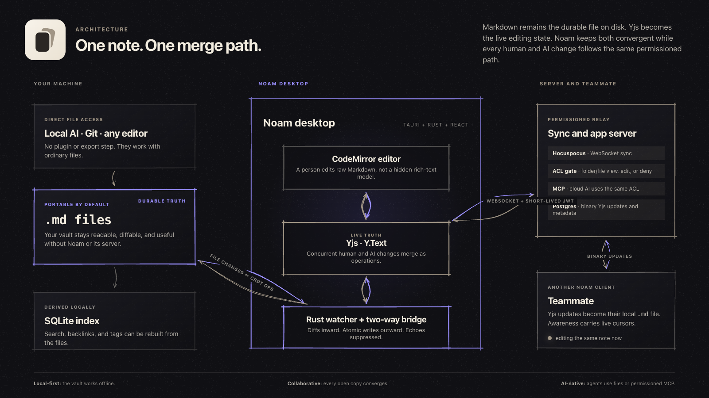

<div align="center">


# noam

### Local-first Markdown for people and AI, edited together in real time.

Noam keeps every note as a real `.md` file on your computer, then adds live collaboration, scoped permissions, and AI access without replacing the files with a proprietary document format.


[Product overview](docs/Noam.md) · [Architecture specs](docs/specs/00-architecture-overview.md) · [Build status](docs/STATUS.md) · [Contributing](CONTRIBUTING.md)

</div>

## Noam in practice


The desktop app keeps the file tree, Markdown editor, links, outline, and graph in one workspace. This screenshot uses Noam's starter vault and contains no private user notes.

## The problem Noam solves

Local Markdown is durable and easy to inspect. It works with Git, text editors, scripts, and local AI agents. Real-time editors solve a different problem: several people can type in the same document without overwriting one another.

Noam keeps both models:

- **Markdown is the durable truth.** Notes remain normal files in a folder you control.
- **Yjs is the live truth.** While a note is open or syncing, edits merge as CRDT operations.
- **A Rust bridge keeps them equal.** File changes become Yjs operations; Yjs changes are written back atomically.
- **Permissions apply before data moves.** Human sync and MCP access use the same folder and file rules.

The result is a workspace a person, teammate, or AI can edit through the interface best suited to them, without creating separate copies of the note.


People edit through Noam, local tools edit the file, and remote clients send authorized operations. The Yjs document and the Markdown file stay two views of the same note.

## Why Noam is different from Obsidian

Obsidian is a strong personal knowledge tool with local Markdown and a mature plugin and theme ecosystem. Noam starts from the same open-file premise. It is built for a shared workspace where people and AI edit the same notes live.

| Question | Noam | Obsidian |
| :--- | :--- | :--- |
| Where are notes stored? | Plain Markdown files in a local folder. | [Plain Markdown files in a local vault](https://obsidian.md/help/Files%2Band%2Bfolders/How%2BObsidian%2Bstores%2Bdata). |
| Can two people edit the same note live? | Yes. Yjs merges concurrent edits and awareness carries live cursors. | [Not through Obsidian Sync](https://obsidian.md/help/Obsidian%2BSync/Collaborate%2Bon%2Ba%2Bshared%2Bvault); changes appear after sync rather than as collaborative live editing. |
| Can access differ by folder, file, or person? | Yes. A grant can allow view or edit access, and an explicit deny can remove access. | [Shared-vault collaborators have the same permissions](https://obsidian.md/help/Obsidian%2BSync/Collaborate%2Bon%2Ba%2Bshared%2Bvault); fine-grained permissions are not supported. |
| How does AI reach the notes? | Local agents edit the files directly. Remote agents use built-in MCP tokens constrained by the same ACL as people. | Through local files, external tools, or community plugins. |
| Who runs sync? | You can run the included Node, Hocuspocus, and Postgres stack on your own infrastructure. | Obsidian Sync is a managed service; [each collaborator needs a Sync subscription](https://obsidian.md/help/Obsidian%2BSync/Collaborate%2Bon%2Ba%2Bshared%2Bvault). |
| What is the product emphasis? | Team editing, governed AI access, and an explicit file-to-CRDT bridge. | Personal knowledge management and a broad [community plugin](https://obsidian.md/help/Extending%2BObsidian/Community%2Bplugins) and [theme](https://obsidian.md/help/Extending%2BObsidian/Themes) ecosystem. |

Noam does not reproduce Obsidian's plugin catalog. It focuses on something Obsidian Sync does not provide: live editing of the same note, backed by local Markdown, with permissions that also govern AI access.


The same access resolver protects live sync and remote MCP calls. Vault posture, roles, direct and inherited grants, locks, and explicit person denies resolve to view, edit, or no access before note data moves.

## Architecture



The bridge does the hard part:

1. A person, Git operation, text editor, or local AI changes a `.md` file.
2. The Rust watcher computes the change and applies it to a Yjs `Y.Text` document.
3. CodeMirror and authorized peers edit that same Yjs document.
4. Remote operations are serialized back to the local file with echo-loop suppression and atomic writes.
5. SQLite indexes search, links, and tags from the files. It is derived data and can be rebuilt.

On the server, Hocuspocus authenticates each document connection. Postgres stores binary Yjs updates and collaboration metadata. The desktop app recreates the readable Markdown file on each authorized device.

## What works today

- Open an existing Markdown folder or create a new vault.
- Edit raw Markdown with autosave, file watching, search, backlinks, and tags.
- Reconcile external file edits with the Yjs document without echo loops.
- Sign in, create a team vault, invite members, and share a vault, folder, or note.
- Assign view, edit, private, and per-person deny rules.
- Sync note content, structure, presence, item colors, and attachments.
- Create MCP tokens for remote agents; local agents can work directly on disk.
- Run the sync stack yourself with Docker and Postgres.

Noam is in active development. There is not yet a published GitHub binary release. The live checklist in [`docs/STATUS.md`](docs/STATUS.md) separates implemented behavior from planned work.

## Build from source

### Requirements

- Node.js 22 or newer
- Corepack and the pinned pnpm version
- Rust and Cargo from [rustup](https://rustup.rs)
- Docker for the local Postgres server

### Install

```bash
git clone <repository-url>
cd noam/app
corepack enable
pnpm install
```

### Start the local server

```bash
cd apps/server
cp .env.example .env
pnpm run db:up
pnpm run migrate
pnpm run dev
```

The HTTP API and sync WebSocket run on port `3010`; sync uses `/sync`.

### Start the desktop app

In a second terminal:

```bash
cd noam/app
pnpm run dev:desktop
```

Open any folder of Markdown files and start writing.

## Run your own server

The Compose bundle starts the app server and Postgres:

```bash
cd deploy/compose
cp .env.example .env
# Set POSTGRES_PASSWORD, JWT_SECRET, and BETTER_AUTH_URL.
docker compose up -d
```

See [`deploy/compose/README.md`](deploy/compose/README.md) for TLS, backups, and upgrades, or [`docs/DEPLOY.md`](docs/DEPLOY.md) for the complete environment reference.

## Connect an AI through MCP

A local agent needs no Noam-specific integration. Give it access to the vault folder and the file watcher will carry its edits into the live document.

For an agent that cannot reach the disk:

1. Open **Vault settings → MCP** and create a token.
2. Point an MCP client at `https://<your-server>/api/mcp`.
3. Send the token as `Authorization: Bearer mcp_…`.

The MCP server exposes tools including `read_note`, `search_notes`, `create_note`, `edit_note`, and `update_note`. Reads return a revision. Supplying it as `expectedRevision` makes a stale write fail instead of replacing newer work.

## Technology

| Layer | Choice | Responsibility |
| :--- | :--- | :--- |
| Desktop shell | Tauri v2 + Rust | Filesystem access, file watching, atomic writes, and native packaging |
| Interface | React + TypeScript + Vite | File tree, editor chrome, sharing, settings, and presence |
| Editor | CodeMirror 6 | Edits raw Markdown without a second document model |
| Live state | Yjs `Y.Text` | Merges concurrent changes as operations |
| Sync | Hocuspocus + WebSocket | Authenticated document sync and awareness |
| Local index | SQLite FTS5 | Derived search, backlinks, tags, and note identity |
| Server data | Postgres | Binary Yjs updates, accounts, vaults, ACLs, and metadata |
| Identity | Better Auth | Accounts, sessions, organizations, and invitations |
| Agent access | Model Context Protocol | Permissioned remote reads and writes |

## Repository map

```text
app/
├── apps/desktop/   Tauri desktop app: Rust core and React interface
└── apps/server/    Node/TypeScript API, sync, auth, permissions, and MCP
deploy/             Docker and Compose deployment assets
docs/               Product notes, architecture specs, status, and operations
```

## Contributing

Issue reports are welcome. Because Noam has not selected a public license or
contribution agreement, arrange code contributions with the maintainers before
opening a pull request. Start with the [architecture overview](docs/specs/00-architecture-overview.md),
then read [CONTRIBUTING.md](CONTRIBUTING.md).

Security reports belong in [SECURITY.md](SECURITY.md), not a public issue.

## License

No public license has been selected for Noam's original work. See
[LICENSING.md](LICENSING.md) for the current status and [NOTICE](NOTICE) for
third-party attribution.
