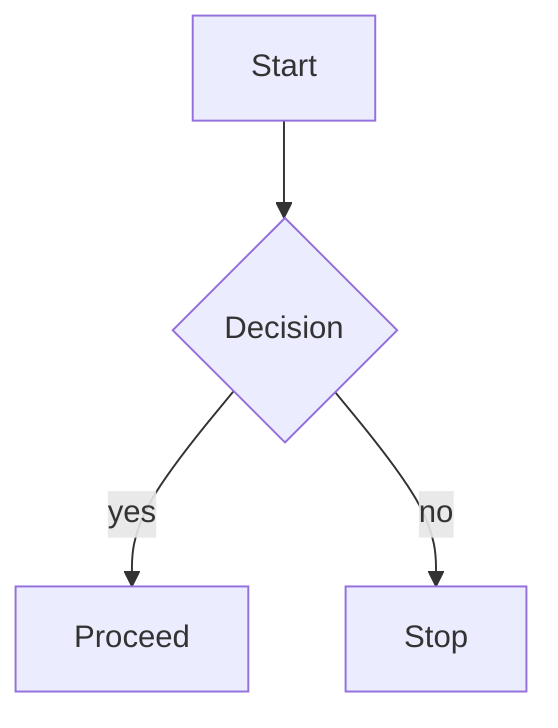
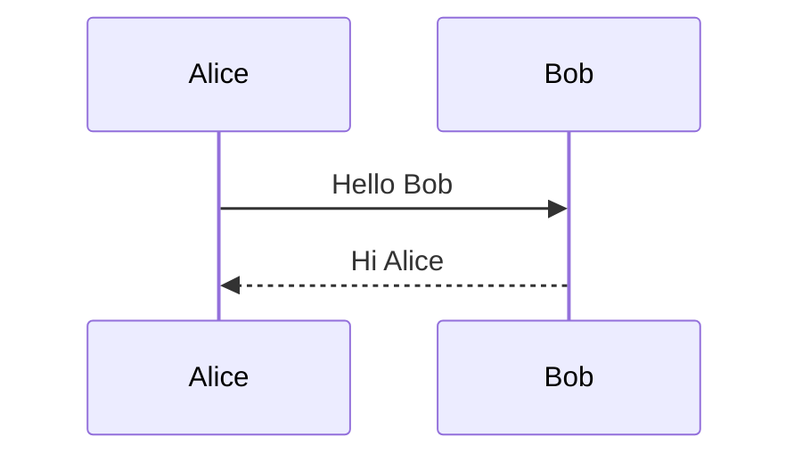

# Diagrams


```mermaid
flowchart TD
    A[Start] --> B{Decision}
    B -->|yes| C[Proceed]
    B -->|no| D[Stop]
```


```mermaid
sequenceDiagram
    Alice->>Bob: Hello Bob
    Bob-->>Alice: Hi Alice
```

A non-mermaid fenced block for contrast:

```text
not a diagram, just text
```
