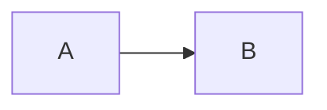

# Kitchen sink

Every construct in one note, the way a real vault note looks.

A paragraph with a [[Wikilink]], an [[Aliased|alias]], **bold**, *italic*,
~~struck~~, ==highlighted==, `inline code`, and a #tag.

## Tasks and lists

- [ ] open task with [[Wikilink#Details]]
- [x] done task
  - nested bullet
    1. nested ordered

## Table and callout

| a | b |
|---|---|
| 1 | 2 |

> [!tip]- Folded tip
> The body hides until expanded.

## Code, math, diagram

```rust
fn main() {
    println!("hello");
}
```

Inline $x^2$ and block:

$$
y = mx + b
$$



## Footnotes and comments

Text with a footnote.[^k] <!-- hidden --> %%also hidden%%

[^k]: footnote body.

## Unicode finale

日本語，한국어, עברית, العربية, 🎉, é.
